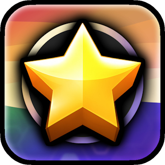
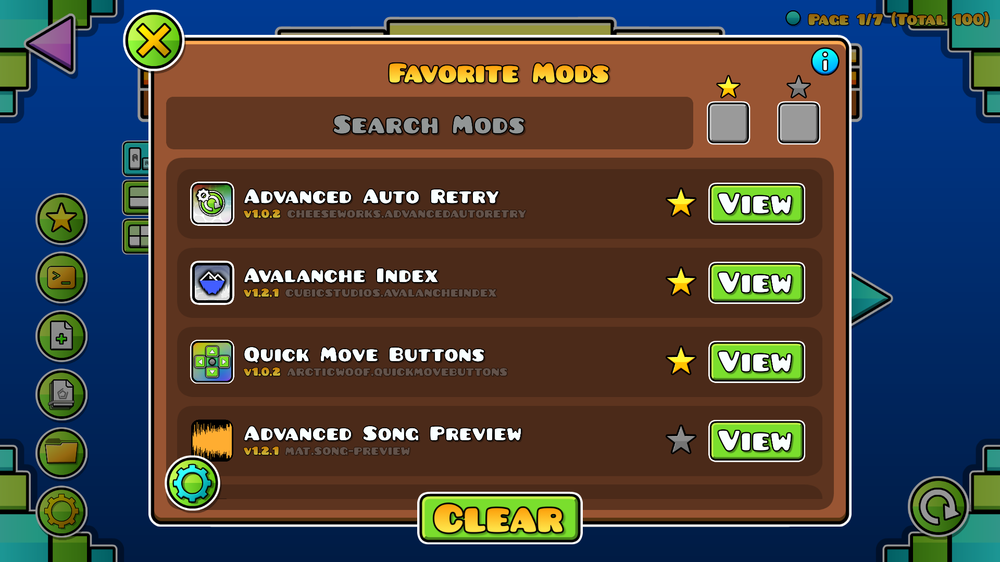
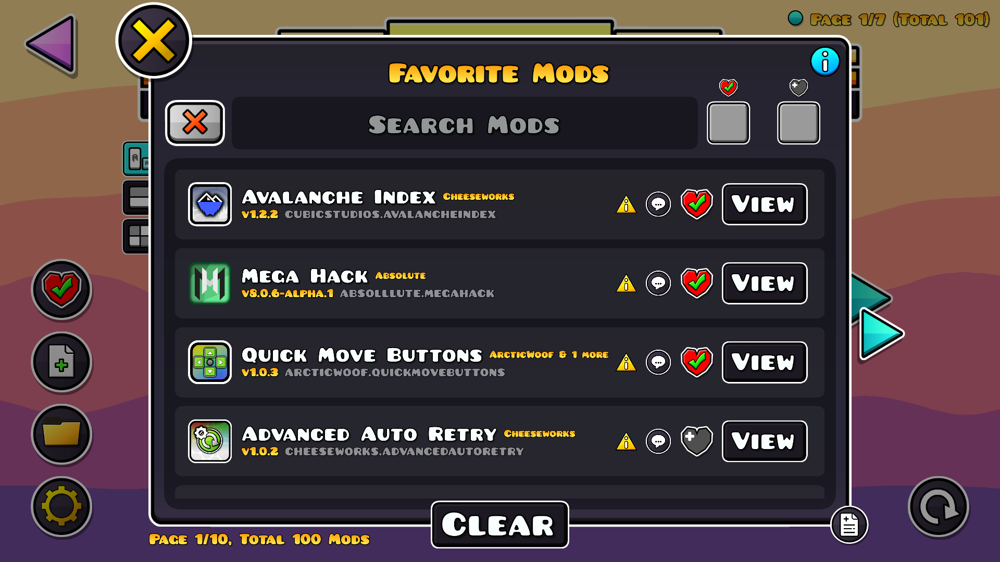
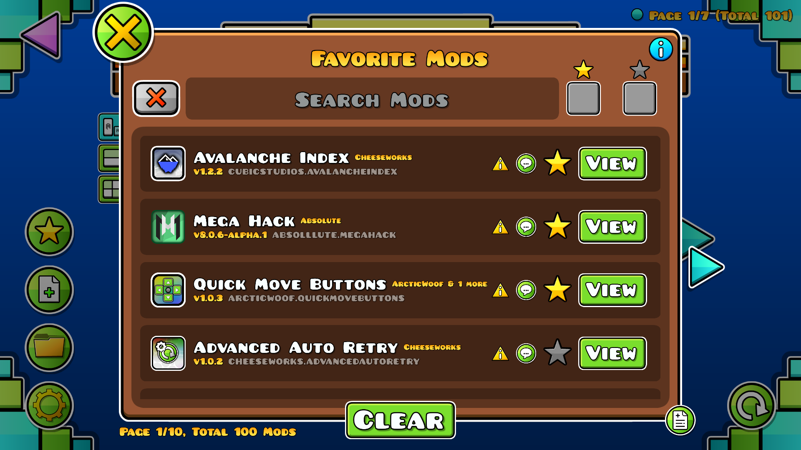
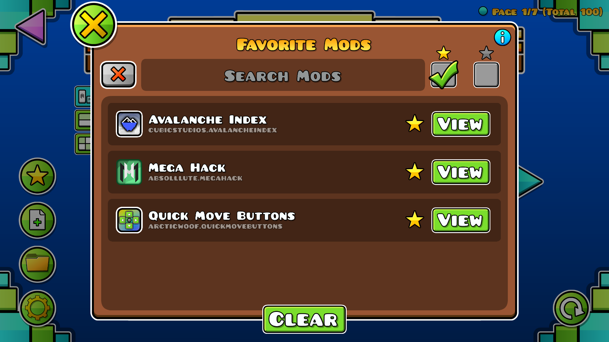

#  Favorite Mods
A shortcut to your favorite Geode mods!

>   

>  
>  
> 

> [!TIP]
> *This mod has settings you can utilize to customize your experience.*

---

## About
This mod creates an easier-to-access UI with your list of installed mods, which prioritizes the mods you chose to be your favorites! Save time when looking for mods you enjoy or need the most.

---

### Favorites
A **new button** will appear on the left-hand side of the Geode mods page that creates a pop-up listing all installed mods, prioritizing the mods you have included in your favorites.

To add a mod to your favorites, simply look for it by scrolling or typing its name, description, or ID in the search box. Then, press the star icon to the right, and it should add it as a favorite mod! You can also press the star again to un-favorite the mod. Favorite mods will always be listed at the top-most part in the first-most page of the list.

You can also quickly add favorites through Geode's mod information pop-ups! Just look for the favorite button below the bottom left corner of the pop-up. This will require that you already have the mod installed.

---

### Credits
- **[ArcticWoof](https://www.github.com/DumbCaveSpider/)**: Helped significantly in designing UI

---

---

### Changelog
###### What's new?!
**[📜 View the latest updates and patches](./changelog.md)**

### Issues
###### What's wrong?!
**[⚠️ Report a problem with the mod](../../issues/)**