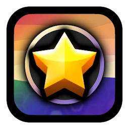
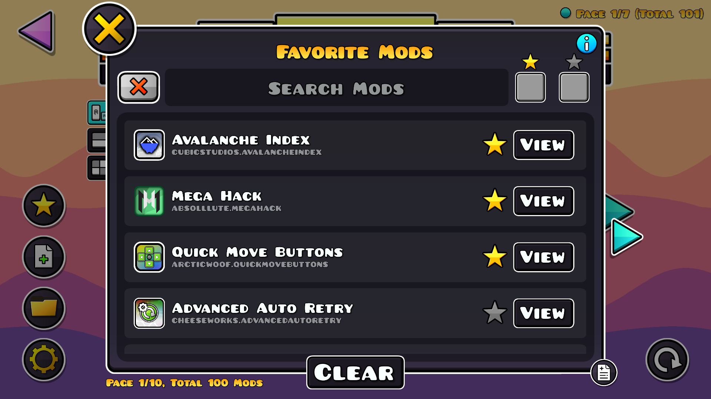
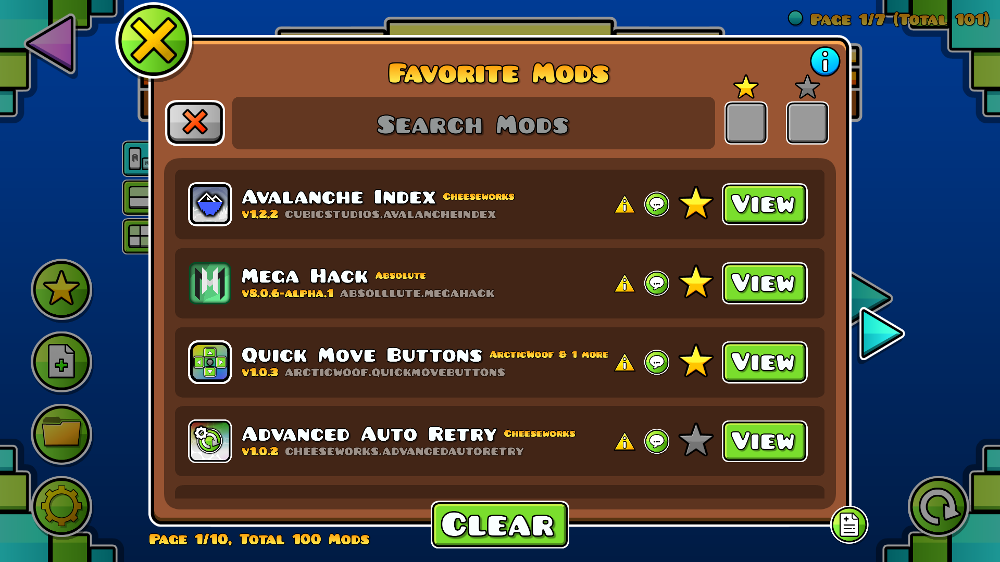
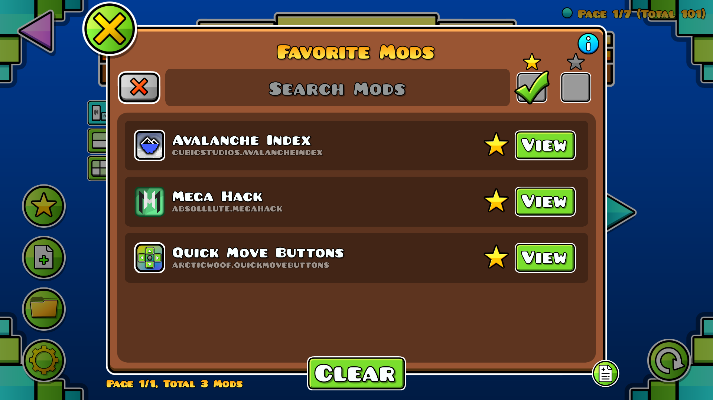
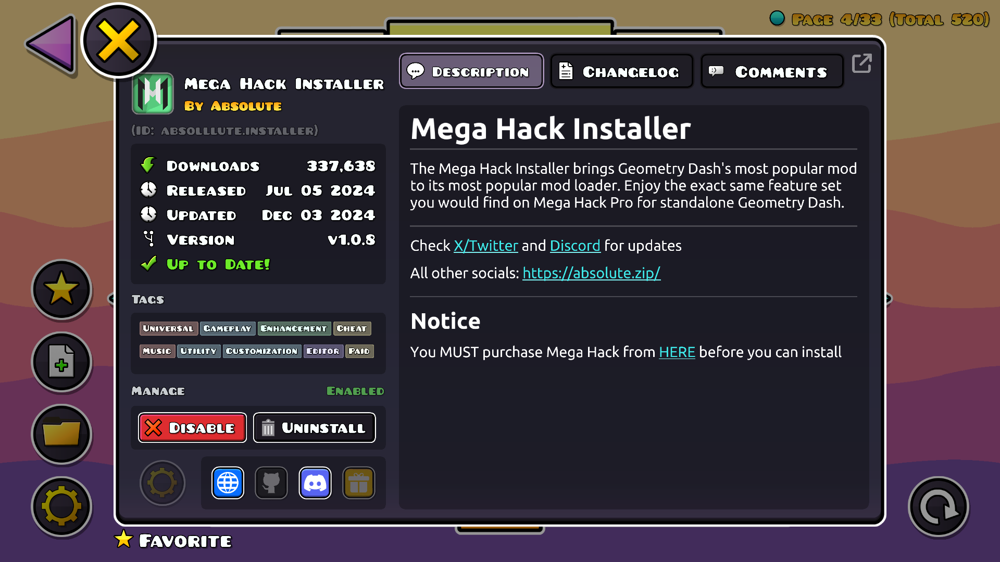
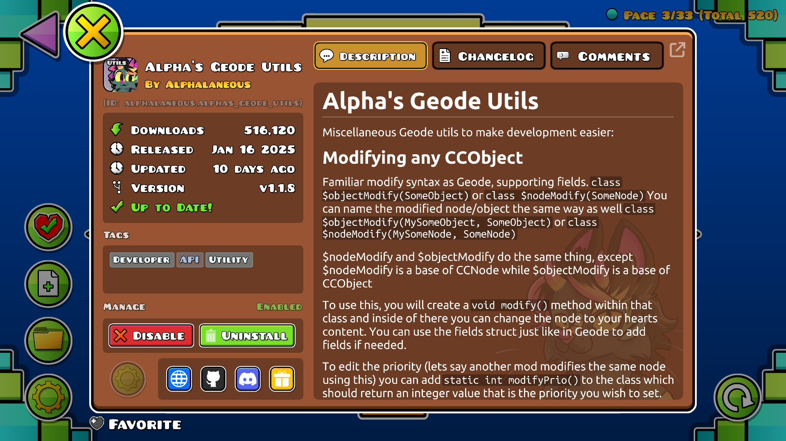

#  Favorite Mods
Add installed Geode mods as your favorites!

>   

>  
>  
> 

> [!TIP]
> *This mod has settings you can utilize to customize your experience.*

---

## About
This mod focuses on creating a dedicated interface with a list of installed mods, which prioritizes the mods the player chose to be their favorites. It allows the player to save time when looking for specific mods they enjoy or need the most.

---

### Favorites
A button will appear on the left-hand side of the Geode mods page that creates a pop-up listing all installed mods, prioritizing the mods you have included in your favorites.

To add a mod to your favorites, simply look for it by scrolling or typing its name, description, or ID in the search box. Then, press the star icon to the right, and it should add it as a favorite mod! You can also press the star again to un-favorite the mod. Favorite mods will always be listed at the top-most part in the first-most page of the list.

You can also quickly add favorites through Geode's mod pop-ups! Just look for the favorite button at the bottom left of the pop-up. This will require that you already have the mod installed.

---

### Credits
- **[ArcticWoof](https://www.github.com/DumbCaveSpider/)**: Helped significantly in designing UI

---

---

### Changelog
###### What's new?!
**[📜 View the latest updates and patches](./changelog.md)**

### Issues
###### What's wrong?!
**[⚠️ Report a problem with the mod](../../issues/)**